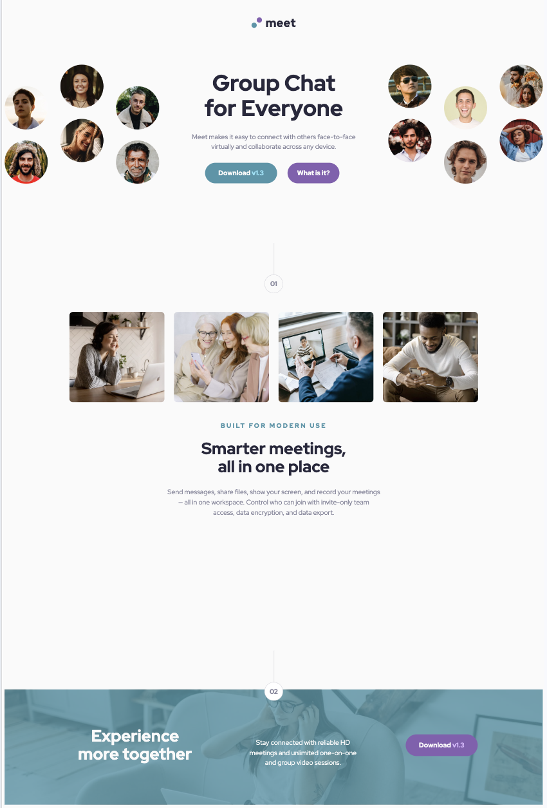

# Frontend Mentor - Meet landing page solution

This is a solution to the [Meet landing page challenge on Frontend Mentor](https://www.frontendmentor.io/challenges/meet-landing-page-rbTDS6OUR). Frontend Mentor challenges help you improve your coding skills by building realistic projects.

## Table of contents

- [Overview](#overview)
  - [The challenge](#the-challenge)
  - [Screenshot](#screenshot)
  - [Links](#links)
- [My process](#my-process)
  - [Built with](#built-with)
  - [What I learned](#what-i-learned)
  - [Continued development](#continued-development)
  - [Useful resources](#useful-resources)
- [Author](#author)

## Overview

This project involved building a landing page to meet the specifications of a challenge set by Frontend Mentor. The purpose of this challenge was to improve coding skills through the completion of a realistic project. The resulting landing page demonstrates the ability to translate a design into a functional website using a variety of coding techniques and technologies.

### The challenge

Users should be able to:

- View the optimal layout depending on their device's screen size
- See hover states for interactive elements

### Screenshot

### Links

- Solution URL: [ljmanayon/landingpage](https://github.com/ljmanayon/meet-landing-page)
- Live Site URL: [meetlandingpage](https://ljmanayon.github.io/meet-landing-page/)

## My process

I started this project by thoroughly studying the design document provided by Frontend Mentor. I then planned out how I would structure my HTML and what elements I would need to create. After that, I set up my development environment and began coding the HTML structure for the landing page.

Once the basic structure was in place, I moved on to styling the page with CSS. I used a mobile-first approach, starting with styles for smaller screens and then adding media queries for larger screen sizes.

Throughout the process, I made sure to frequently test my code in multiple browsers to ensure consistency and identify any issues. After completing the initial version of the landing page, I went through several rounds of revisions to fine-tune the design and improve the site's performance and accessibility.

Finally, I validated my HTML and CSS code to make sure it followed best practices and was free of errors. After a final round of testing and revisions, I considered the project complete.

### Built with

- Semantic HTML5 markup
- CSS custom properties
- Flexbox
- CSS Grid
- Mobile-first workflow

### What I learned

Through this project, I learned a great deal about working with CSS Flexbox and Grid. These are two powerful layout systems that can make designing complex web layouts much easier.

Flexbox is a one-dimensional layout model, and it is particularly useful when you need to align items in a single row or column. It makes it easy to distribute space and align content in ways that web apps often need.

On the other hand, CSS Grid is a two-dimensional layout system, and it’s ideal for laying out items in rows and columns. It makes creating complex grid layouts straightforward and intuitive.

I used both Flexbox and CSS Grid in this project. They provided me with the flexibility to implement a design that is both responsive and user-friendly. I was able to practice and improve my skills in using these techniques throughout the project.

### Continued development

As I continue to work on more projects, I aim to further develop my understanding of both Flexbox and CSS Grid. While I'm comfortable using these layout systems, I believe there's always more to learn and room for improvement. I also plan to delve deeper into other CSS techniques and JavaScript to enhance the interactivity and functionality of the websites I build. Additionally, I'm keen to learn more about accessibility and performance optimization to ensure the sites I create offer the best user experience possible.

### Useful resources

- [guide to grid](https://www.joshwcomeau.com/css/interactive-guide-to-grid/)

## Author

- Website - [Lucsan Manayon](https://github.com/ljmanayon)
- Frontend Mentor - [@ljmanayon](https://www.frontendmentor.io/profile/ljmanayon)
